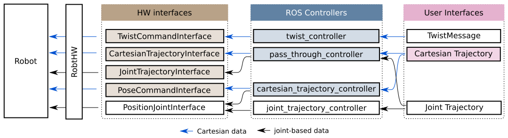

# Cartesian ROS Controllers

This package brings mechanisms for Cartesian control to the ROS-control framework.

## Overview

New functionality (colored):




## Rationale

As opposed to joint-based control, Cartesian control is often more intuitive for programmers to specify how a tool (robot end-effector) should move in their application.
For instance, gluing, grinding, polishing and all sorts of other surface-related tasks benefit from a straight-forward task formulation with Cartesian coordinates.

Currently, there is no support of Cartesian control in ROS. Yet, the number of OEMs, whose drivers support Cartesian control interfaces is growing.
This set of packages aims at filling this gap and get you started with Cartesian control.


## Major features at a glance
- **Add Cartesian functionality to ROS control**. This brings new interfaces for
  controller design, such as a ```PoseCommandInterface```, a ```TwistCommandInterface```, and a new Cartesian trajectory  definition. Example controllers include a ```TwistController``` and a ```CartesianTrajectoryController```.

- **Enable Cartesian trajectory control** in your applications. Specify your task comfortably with
  waypoints in task space. ROS-side interpolation and streaming of setpoints over the new interfaces
  is only one of several alternatives. See the
  [`cartesian_control_msgs`](https://github.com/UniversalRobots/Universal_Robots_ROS_cartesian_control_msgs)
  package for details about the interface definition.

- **Use (conventional) ROS control** for Cartesian trajectory execution. You don't need to change
  anything in the driver's HW-abstraction of your specific robot if that supports current ROS
  control. The `position_controllers/CartesianTrajectoryController` controller uses an IK solver to
  generate joint commands from the Cartesian trajectory during runtime. Thus, existing joint command
  interfaces (which should be present in most ROS-Control-enabled robot drivers) are sufficient for
  using this controller.

- **Hand-over control to the robot by forwarding trajectories**.
Two new interfaces ```CartesianTrajectoryInterface``` and ```JointTrajectoryInterface``` let robots
take care of driver-side interpolation to achieve best performance. This functionality lives in a
[separate repository](https://github.com/UniversalRobots/Universal_Robots_ROS_passthrough_controllers).

- **Speed-scale trajectory execution**. All trajectory executions (both Cartesian and joint-based) can be speed-scaled within 0 to 100% at runtime. This gives you flexibility in setting-up new applications and during test runs. Changing this continuously even lets you reshape trajectory execution without re-teaching. This functionality lives in a
[separate
repository](https://github.com/UniversalRobots/Universal_Robots_ROS_scaled_controllers) but is
used for controllers in this repository.


## Robots Overview
In the spirit of ROS control, the implementation is robot-agnostic and shall support applications on
a wide range of robots. The table below shows what features will be available with this enhancement.
Robot drivers with a hardware interface adapted specifically for those new features will support
more features than existing ones without modifications.

| Feature                                               | Robot drivers with adapted HW interface | Robots with current ROS control |
| --------                                              | --------                                | ---                             |
| Cartesian trajectory control using joint-commands     | &check;                                 | &check;                         |
| Cartesian trajectory control using Cartesian commands | &check;                                 |                                 |
| Cartesian trajectory forwarding                       | &check;                                 |                                 |
| Joint trajectory forwarding                           | &check;                                 |                                 |
| Speed-scale trajectories                              | &check;                                 |                                 |


## Acknowledgement
Developed in collaboration between:

[](https://www.universal-robots.com/) &nbsp; and &nbsp;
[](https://www.fzi.de).

***
<!--
    ROSIN acknowledgement from the ROSIN press kit
    @ https://github.com/rosin-project/press_kit
-->

<a href="http://rosin-project.eu">
  
</a>

Supported by ROSIN - ROS-Industrial Quality-Assured Robot Software Components.
More information: <a href="http://rosin-project.eu">rosin-project.eu</a>


This project has received funding from the European Union’s Horizon 2020
research and innovation programme under grant agreement no. 732287.
