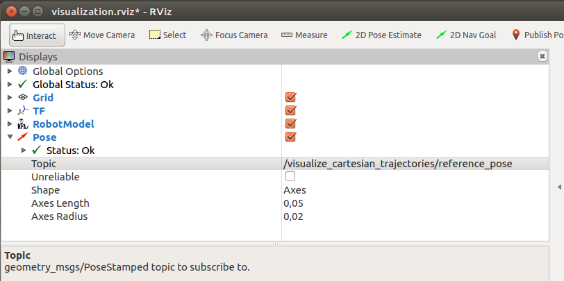

# Cartesian Trajectory Controller
A simple Cartesian trajectory controller that uses the new Cartesian trajectory definition.

## Rationale
This controller shall get you started with executing Cartesian trajectories on your robot.
It implements a simple action server for `FollowCartesianTrajectory`. There are currently two ways of execution, depending on the interface provided by the robot.

The table below highlights possible applications.

| Hardware interface | Primary application |
| -------- | -------- |
| ``PoseCommandInterface``    | You want spline interpolation in ROS but the OEMs driver to take care of inverse kinematics (IK). This variant requires the new Cartesian interfaces.
| ``PositionJointInterface``     | You want spline interpolation in ROS and implement your own IK solver. The provided example uses the established Weighted Levenberg-Marquardt solver form KDL. This variant is compatible with current ROS-control so that you need not change your RobotHW abstraction.


## Controller .yaml
An example config for the Universal Robots UR10 looks like this:
```yaml
# This controller uses a Cartesian pose interface for control.
# Inverse Kinematics is handled by the robot itself.
pose_cartesian_traj_controller:
    type: "pose_controllers/CartesianTrajectoryController"

    # This type uses the names according to UR driver convention.
    # They need not neccessarily exist in the robot_description
    # and are only used to get the correct control handle from the
    # hardware interface.
    base: "base"
    tip: "tool0_controller"

    joints:
       - shoulder_pan_joint
       - shoulder_lift_joint
       - elbow_joint
       - wrist_1_joint
       - wrist_2_joint
       - wrist_3_joint

# This controller uses a joint position interface for control.
# Inverse Kinematics is handled by the controller.
jnt_cartesian_traj_controller:
    type: "position_controllers/CartesianTrajectoryController"

    # This type requires valid URDF links and they are used to
    # set-up an internal kinematics chain. Make sure that they correspond to the drivers' frames.
    # In this case, tool0 and tool0_controller are identical, but the latter
    # one does not exist in the URDF description.
    base: "base"
    tip: "tool0"

    joints:
       - shoulder_pan_joint
       - shoulder_lift_joint
       - elbow_joint
       - wrist_1_joint
       - wrist_2_joint
       - wrist_3_joint

```
## Interpolation between waypoints
This Cartesian trajectory controller builds on the [joint_trajectory_controller](http://wiki.ros.org/joint_trajectory_controller)'s quintic spline library.

That library is internally wrapped to work in Cartesian space dimensions and inherits the essential interpolation mechanisms:

- If only poses are specified, linear interpolation will be used.
- If poses and twists are specified, a cubic spline will be used.
- If poses, twists and accelerations are specified, a quintic spline will be used.
- If two succeeding waypoints have different specifications
  (eg. waypoint 1 is pose-only, end waypoint 2 is pose-twist), the lowest common specification will be used
  (pose-only in the example).

---
**Note**:
By means of the default ROS message initializer, the waypoints' twist and acceleration fields will be zero-initialized.
Those zeros will be interpreted as _intended_ boundary conditions on velocity and accelerations level.
As a consequence, specifying pose-only Cartesian trajectories will lead to smooth stops in each waypoint by default (= quintic interpolation with zero velocity/acceleration boundaries).

---

If you want linear behavior for your pose-only Cartesian trajectory, i.e. you don't want those stops, you should mark at least one of the twist field values as _uninitialized_ by setting a `NaN` equivalent.
Here are two examples how to do that in client code:

In C++:
```c++
#include <cartesian_control_msgs/CartesianTrajectoryPoint.h>

cartesian_control_msgs::CartesianTrajectoryPoint p;
// Fill p.pose here
p.twist.linear.x = std::nan("0");  // this will declare p.twist uninitialized.
```

or in Python:
```python
from cartesian_control_msgs.msg import CartesianTrajectoryPoint

p = CartesianTrajectoryPoint()
# Fill p.pose here

p.twist.linear.x = float('NaN')  # this will declare p.twist uninitialized.
```

Here are further details:
- Marking twist as uninitialized automatically marks acceleration uninitialized.
- Uninitializing only individual fields is currently not supported. A single `NaN` in any Cartesian dimension uninitializes the whole twist/acceleration quantity.
- Note that if you intentionally specify non-zero boundaries for some of the twist/acceleration dimensions, the other dimensions are implicitly 0 by their default initializer.

## Customizing Inverse Kinematics

Plugins allow you to implement your own (possibly more advanced) Inverse Kinematics algorithm. For instance, you may wish
to use additional sensors in your environment and react online to objects and collisions.

Take a look at the provided *example_solver* on how to use the plugin mechanism for your custom implementation.
You can then specify the *ik_solver* at startup in form of a controller-local parameter in the .yaml controller config file:

```yaml
jnt_cartesian_traj_controller:
     type: "position_controllers/CartesianTrajectoryController"
     ik_solver: "example_solver"
     ...

```

## Visualizing Cartesian trajectories

For some use cases, it might be advantageous to visualize Cartesian trajectories before commanding an actual robot.
Especially when specifying twist and acceleration boundary conditions for the waypoints,
the resulting motion might not be intuitive and you might want to check _visually_ if that's what you expect.
There's an easy mechanism that allows you to do that.

Add an additional `CartesianTrajectoryPublisher` as read-only
controller to your set of ROS controllers.  It offers the `CartesianTrajectoryController`'s
action interface but does not claim resources nor actuates the robot's
joints.  It just publishes the trajectory's interpolated Cartesian state
as reference `PoseStamped` and `TwistStamped` messages.

The controller specification in .yaml could look like this:

```yaml
visualize_cartesian_trajectories:
    type: "cartesian_trajectory_publisher/CartesianTrajectoryPublisher"
    base: "base_link"
    tip: "tool0"
    joints:
       - shoulder_pan_joint
       - shoulder_lift_joint
       - elbow_joint
       - wrist_1_joint
       - wrist_2_joint
       - wrist_3_joint
```

---
**Note**: It does _not_ check reachability of the robot end-effector by means of inverse kinematics, nor collisions.
Its purpose is to offer an easy way for users to test whether their Cartesian trajectories
_look_ as expected.

---

You can then use the controller's `visualize_cartesian_trajectories/follow_cartesian_trajectory` action interface and inspect
the trajectory by adding a _Pose_ visualization (`geometry_msgs::PoseStamped`) in RViz for the *visualize_cartesian_trajectories/reference_pose* topic:




## Acknowledgement
Developed in collaboration between:

[](https://www.universal-robots.com/) &nbsp; and &nbsp;
[](https://www.fzi.de).

***
<!--
    ROSIN acknowledgement from the ROSIN press kit
    @ https://github.com/rosin-project/press_kit
-->

<a href="http://rosin-project.eu">
  
</a>

Supported by ROSIN - ROS-Industrial Quality-Assured Robot Software Components.
More information: <a href="http://rosin-project.eu">rosin-project.eu</a>


This project has received funding from the European Union’s Horizon 2020
research and innovation programme under grant agreement no. 732287.
